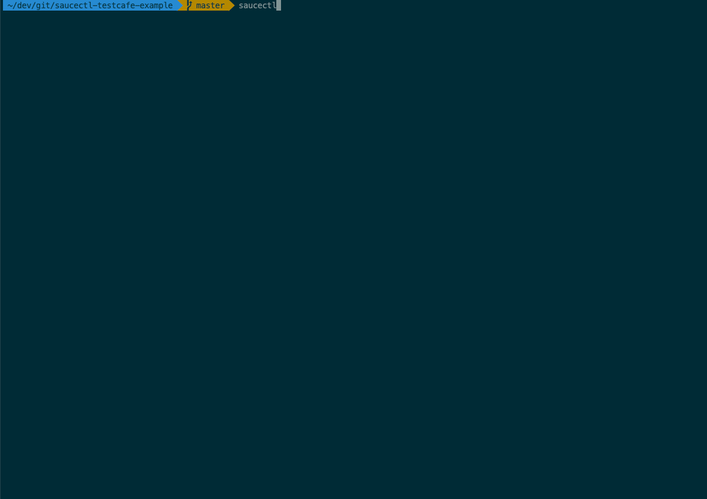

# saucectl testcafe example

Example running saucectl with testcafe.

## What You'll Need

The steps below illustrate one of the quickest ways to get set up. If you'd like a more in-depth guide, please check out
our [documentation](https://docs.saucelabs.com/testrunner-toolkit/installation).

### Install `saucectl`

```shell
npm install -g saucectl
```

### Set Your Sauce Labs Credentials

```shell
saucectl configure
```

## Running The Examples

Simply check out this repo and run the appropriate command below :rocket:

### In Docker

```shell
saucectl run -c .sauce/config_docker.yml
```



### In Sauce Cloud

```shell
saucectl run -c .sauce/config.yml
```


### In Sauce Cloud with iOS Simulators
# TODO (change gif file to ios + sauce mode)

```shell
saucectl run -c .sauce/config_ios.yml
```


## The Config

[Follow me](.sauce/config.yml) if you'd like to see how saucectl is configured for this repository. 
